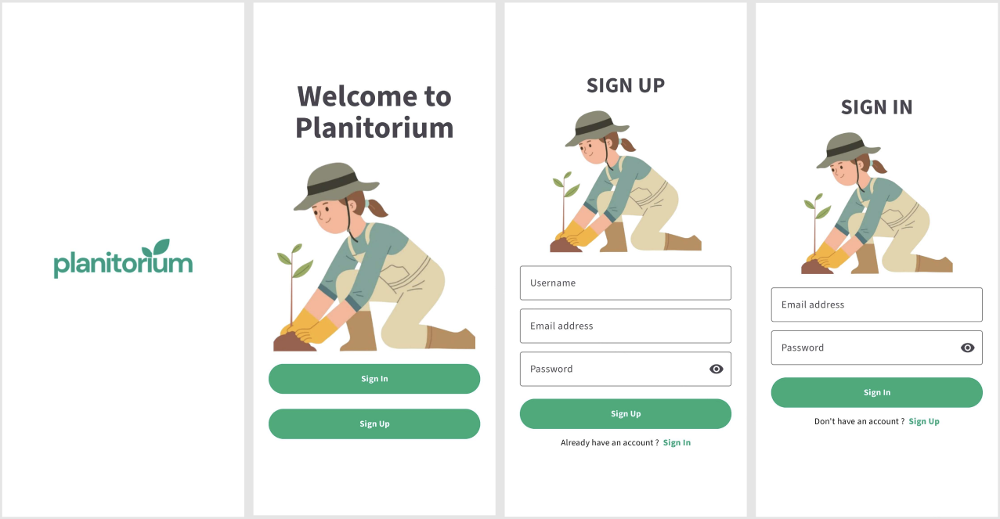
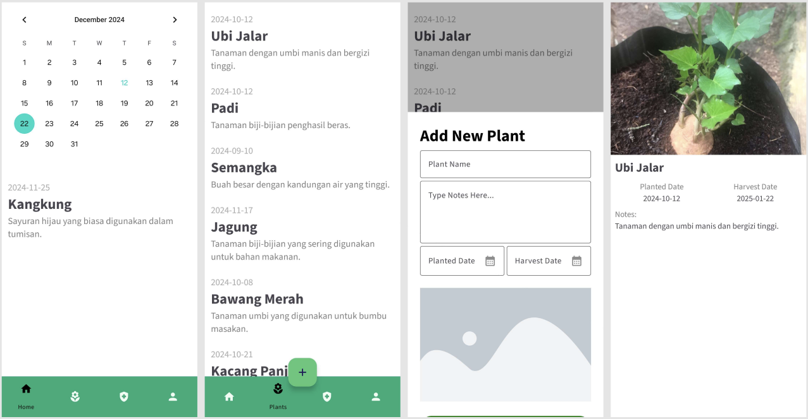
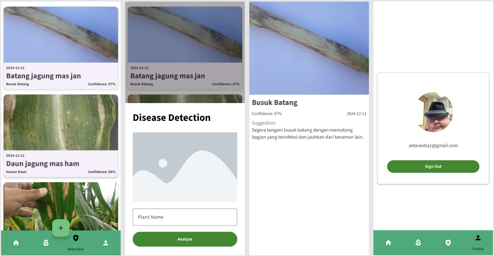

<h1>Planitorium</h1>
<h6>Application for corn disease detection in Indonesia.</h6>

Our Prototype Mobile App :

https://www.figma.com/design/pZDq9gmQn28fj1vFTri64d/Planitorium?node-id=0-1&t=4JfqM2m1iniCZt4t-1

<h1>Our Team</h1>

| Bangkit ID   | Name                            | Learning Path      | Universitas                            |
| ------------ | ------------------------------- | ------------------ | -------------------------------------- |
| C281B4KY0151 | Afif Hamzah                     | Cloud Computing    | Universitas Negeri Medan               |
| C281B4KY2315 | Muhammad Fauzan Fachruzi Rauf   | Cloud Computing    | Universitas Negeri Medan               |
| M204B4KX0722 | Aulia Aisyah Putri              | Machine Learning   | Universitas Esa Unggul                 |
| M123B4KX1977 | Indrany Apriliana Shanty        | Machine Learning   | Politeknik Elektronika Negeri Surabaya |
| M172B4KY2344 | M. Fikri                        | Machine Learning   | Universitas Mikroskil                  |
| a172b4ky1189 | Dustin Lionel                   | Mobile Development | Universitas Mikroskil                  |
| a172b4ky3088 | Muhammad Shahwal Ramadhan Boger | Mobile Development | Universitas Mikroskil                  |
